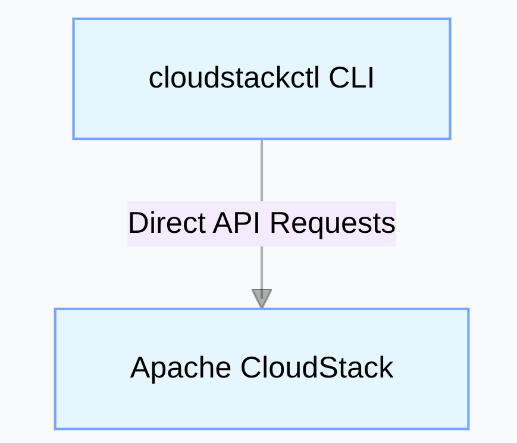
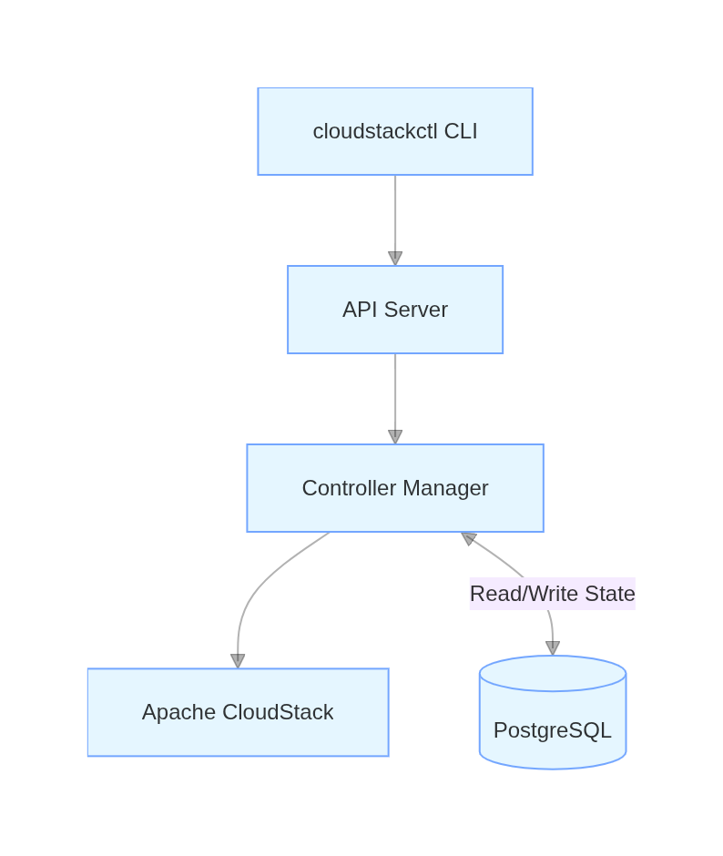

# cloudstackctl (csctl)

Kubernetes-style declarative orchestration tool for Apache CloudStack

For local development configuration see [Development.md](Development.md).

---

# Architecture Overview

* Single `cloudstackctl` binary provides the CLI.
* Single `cloudstackctl-controller` binary provides the API server and controller runtime.
* Controller sends async requests to CloudStack API, writes desired & observed state, manages health checks and dependency graph. It exposes a small health endpoint on port `65426` (`/health`).
* CLI operates locally and uses the CloudStack client to perform direct actions when appropriate; credentials are loaded from a config file (see `-c`) or environment variables (`.env.cloudstack` is used by default if present).

There are two supported mode:

- **Standalone mode (`-s` / `--standalone`):** CLI-only mode that talks directly to CloudStack APIs and does not read or write the database. Use this for quick ad-hoc operations without running the controller. Controller mode requires running the controller and Postgres (see Development.md).

- **Controller mode (default):** `cloudstackctl` operates with a PostgreSQL backing store and a controller process that reconciles desired state with CloudStack. Resources are managed via the database/controller.

## Standalone mode



## Controller mode




---

## Two Modes With YAML Support

| Feature | Standalone Mode | Controller mode |
|---|---|---|
| Purpose | Direct CloudStack resource management using YAML | Declarative orchestration with controller and DB |
| Architecture | CLI → CloudStack API | CLI → API Server → PostgreSQL → Controller → CloudStack API |
| Controller | No | Yes |
| Database | No | Yes (PostgreSQL stores desired state) |
| Execution | CLI parses YAML and performs API calls immediately | CLI posts to API server; controller reconciles desired state |
| Typical YAML kinds | VirtualMachine, Network, Volume, SecurityGroup, AffinityGroup, SSHKey, UserData | Application, Component, VirtualMachineSpec, VirtualMachine, Network, Volume, SecurityGroup, AffinityGroup, SSHKey, UserData |

### Resource Support Matrix

| Resource | Standalone Mode | Controller mode |
|---|:---:|:---:|
| VirtualMachine | ✅ | ✅ |
| Network | ✅ | ✅ |
| Volume | ✅ | ✅ |
| SecurityGroup | ✅ | ✅ |
| AffinityGroup | ✅ | ✅ |
| SSHKey | ✅ | ✅ |
| UserData | ✅ | ✅ |
| Application | ❌ | ✅ |
| Component | ❌ | ✅ |
| VirtualMachineSpec | ❌ | ✅ |


# Supported Resource Types and Actions

| Kind                   | Shortnames                               | Description                             | Actions Supported                                                                                         | Kubernetes Equivalent                    |
| ---------------------- | ---------------------------------------- | --------------------------------------- | --------------------------------------------------------------------------------------------------------- | ---------------------------------------- |
| **Application**        | app, apps                                | Full application or service stack       | create, update, delete, get, describe                                                                     | Namespace / Application CRD              |
| **Component**          | comp, comps                              | Set of VMs for a specific role          | create, update, delete, get, describe, scale                                                              | Deployment / StatefulSet                 |
| **VirtualMachine**     | vm, vms                                  | Individual VM instance                  | create, update, delete, get, describe                                                                     | Pod                                      |
| **VirtualMachineSpec** | vmspec, vmspecs                          | VM specifications for Components        | create, update, delete, get, describe                                                                     | PodTemplateSpec                          |
| **Network**            | net, nets, network, networks             | CloudStack network                      | create, update, delete, get, describe                                                                     | NetworkPolicy / Service                  |
| **Volume**             | vol, vols, volume, volumes               | Disk attached to VMs                    | create, update, delete, get, describe                                                                     | PersistentVolume / PersistentVolumeClaim |
| **SSHKey**             | key, keys, sshkey, sshkeys               | Key pair for VM access                  | create, update, delete, get, describe                                                                     | Secret                                   |
| **UserData**           | userdata, ud, uds                        | User data scripts for VM initialization | create, update, delete, get, describe                                                                     | ConfigMap / Secret                       |
| **AffinityGroup**      | ag, affinitygroup, affinitygroups        | Host/VM affinity or anti-affinity       | create, update, delete, get, describe                                                                     | PodAffinity / PodAntiAffinity            |
| **SecurityGroup**      | sg, sgs, securitygroup, securitygroups   | Firewall rules for VMs                  | create, update, delete, get, describe                                                                     | NetworkPolicy                            |

---

## Resource Field Reference

Quick reference for the key fields users will commonly set for higher-level resources.

**Application**

| Field | Type | Description |
|---|---|---|
| `metadata.name` | string | Application name |
| `spec.project` | string | CloudStack project UUID or name |
| `spec.components` | list | Ordered list of component references (name, vmspec, replicas) |

**Component**

| Field | Type | Description |
|---|---|---|
| `metadata.name` | string | Component name (used to derive VM names) |
| `spec.virtualMachineSpec` | string | Name of reusable `VirtualMachineSpec` to use |
| `spec.replicas` | int | Number of VM replicas to create |
| `spec.overrides.userDataRefs` | list | Optional: references to `UserData` to apply to this component's VMs |
| `spec.overrides.sshKeys` | list | Optional additional SSH keys to merge into the VM spec |

**VirtualMachineSpec**

| Field | Type | Description |
|---|---|---|
| `metadata.name` | string | Reusable VM spec identifier |
| `spec.template` | string | Template name or ID |
| `spec.serviceOffering` | string | Service offering (size) |
| `spec.networks` | list | Network IDs to attach |
| `spec.sshKeys` | list | SSH key names to inject |
| `spec.userDataRefs` | list | Optional references to `UserData` resources |
---

# YAML Examples

### VirtualMachineSpec

```yaml
apiVersion: cloudstackctl/v1
kind: VirtualMachineSpec
metadata:
  name: basic-vm-spec
spec:
  zone: zone-1
  template: ubuntu-22.04
  serviceOffering: medium
  networks:
    - existing-network-1-id
  sshKeys:
    - platform-admin
  volumes:
    - name: data-disk
      diskOffering: standard-hdd
      size: 50
```

### Component Reusing VirtualMachineSpec

```yaml
apiVersion: cloudstackctl/v1
kind: Application
metadata:
  name: app-with-reused-vmspec
spec:
  project: project-2
  components:
    - name: frontend
      virtualMachineSpec: basic-vm-spec
      overrides:
        - sshKeys: web
      replicas: 2
      healthChecks:
        - type: ping
          interval: 10s
          timeout: 5s
```

### Application with Multiple Components

```yaml
apiVersion: cloudstackctl/v1
kind: Application
metadata:
  name: simple-app
spec:
  project: project-2
  components:
    - name: frontend
      virtualMachineSpec: basic-vm-spec
      replicas: 2
    - name: backend
      virtualMachineSpec: basic-vm-spec
      replicas: 1
```

### Standalone VirtualMachine

```yaml
apiVersion: cloudstackctl/v1
kind: VirtualMachine
metadata:
  name: standalone-vm
spec:
  zone: zone-1
  project: project-2
  template: ubuntu-22.04
  serviceOffering: medium
  networks:
    - existing-network-1-id
  sshKeys:
    - platform-admin
  volumes:
    - name: data-disk
      diskOffering: standard-hdd
      size: 50
  affinityGroups:
    - vm-spread
  securityGroups:
    - default-sec
  parameters:
    bootMode: SECURE
    bootType: UEFI
```

Usage notes:

- To run the CLI in standalone mode (no DB/controller): `./cloudstackctl -s get VirtualMachine` or `./cloudstackctl -s apply -f vm.yaml`.
- To run in controller mode (default), ensure the controller and Postgres are running; `apply` will send resources to the controller which persists them to the DB and reconciles via CloudStack.

---

# Logging and Troubleshooting

| Component  | Logs / Errors                                                   | Access                                                                     |
| ---------- | --------------------------------------------------------------- | -------------------------------------------------------------------------- |
| CLI        | Command output, validation, API responses                       | Console (`--verbose` or `--debug`)                                         |
| Controller | Reconciliation, CloudStack API, health checks, dependency graph | `kubectl logs <controller-pod>` or `/var/log/cloudstackctl-controller.log` |
| PostgreSQL | Connection or transaction errors                                | Standard PostgreSQL logs                                                   |

**Debugging Tips:**

* CLI: `--verbose` / `--debug` for step-by-step and API payload logs
* Controller: `DEBUG=true` for full CloudStack API logging
* Check PostgreSQL for DB connection errors

---

# Database

* **PostgreSQL** only
* Stores desired and observed state
* ACID transactions, JSONB support for YAML specs

Configuration: the server reads the DB connection from `DATABASE_DSN` if set,
or assembles one from `PGHOST`, `PGUSER`, `PGPASSWORD`, `PGDATABASE`, `PGPORT`,
and `PGSSLMODE`. Example env vars:

```bash
# preferred: provide a single DSN
export DATABASE_DSN="host=localhost user=postgres password=secret dbname=cloudstackctl port=5432 sslmode=disable"

# or set individual PG* variables
export PGHOST=localhost
export PGUSER=postgres
export PGPASSWORD=secret
export PGDATABASE=cloudstackctl
export PGPORT=5432
export PGSSLMODE=disable
```

---

# Deployment

* **Local:** See [Local development](Development.md) for setup (uses `kind` cluster for controller and PostgreSQL in examples)
* **Production:** Kubernetes or VM cluster, CloudStack manages actual VM provisioning

---

# Future Enhancements

* CLI: Rolling updates
* CLI: Support resource update via YAML file
* CLI: Support CloudStack projects
* CLI: Multi-zone deployments
* CLI: Security group improvements
* CLI/Controller: Support reconciling resources
* Controller: Support network services of isolated network
* Controller: Advanced health checks
* Controller: Dependency graph visualization
* Controller: Self-healing of VMs and components
* Controller: Scaling of components
* Controller: Configurable timeout settings

---

# License

Apache License 2.0
